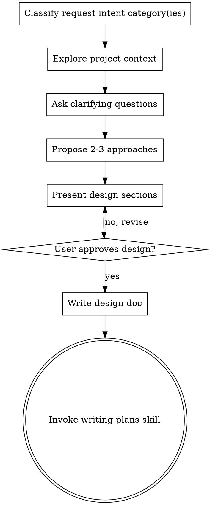

# Brainstorming Ideas Into Designs

## Overview

Help turn ideas into fully formed designs and specs through natural collaborative dialogue.

Start by understanding the current project context, then ask questions one at a time to refine the idea. Once you understand what you're building, present the design and get user approval.

<HARD-GATE>
Do NOT invoke any implementation skill, write any code, scaffold any project, or take any implementation action until you have presented a design and the user has approved it. This applies to EVERY project regardless of perceived simplicity.
</HARD-GATE>

## Anti-Pattern: "This Is Too Simple To Need A Design"

Every project goes through this process. A todo list, a single-function utility, a config change — all of them. "Simple" projects are where unexamined assumptions cause the most wasted work. The design can be short (a few sentences for truly simple projects), but you MUST present it and get approval.

## Intent Categories

Classify request intent category(ies) before project context exploration.

| intent category | use when |
|---|---|
| `behavioral-change:new-feature` | User wants a new externally observable capability |
| `behavioral-change:modify-feature` | User wants to change behavior of an existing capability |
| `behavioral-change:bugfix` | User wants to fix unintended behavior |
| `behavioral-change:enhance-quality-attribute` | User wants behavioral changes for performance, security, reliability, or availability |
| `structural-change` | User wants structural changes without external behavior changes |
| `documentation` | User wants documentation-focused outputs |
| `general` | Else case when none of the categories above fit clearly |

Classification rules:
- Split multi-intent prompts into an explicit intent list.
- Process intents in the order the user mentioned them.
- If the user explicitly states priority (for example, "first", "priority", "most important"), follow that over mention order.
- If safety or dependency constraints require reordering, explain why and get user confirmation.
- Behavioral-change disambiguation: use `behavioral-change:bugfix` for unintended behavior fixes, `behavioral-change:modify-feature` for product behavior changes, and `behavioral-change:enhance-quality-attribute` when quality attributes are the primary goal.
- `general` is intentionally free-form: no preset question template; the agent uses judgment.

## Checklist

You MUST create a task for each of these items and complete them in order:

1. **Classify request intent category(ies)** — identify one or more categories from `Intent Categories`
2. **Explore project context** — check files, docs, recent commits
3. **Ask clarifying questions** — one at a time, understand purpose/constraints/success criteria
4. **Propose 2-3 approaches** — with trade-offs and your recommendation
5. **Present design** — in sections scaled to their complexity, get user approval after each section
6. **Write design doc** — save to `docs/plans/YYYY-MM-DD-<topic>-design.md` and commit
7. **Transition to implementation** — invoke writing-plans skill to create implementation plan

## Process Flow

**The terminal state is invoking writing-plans.** Do NOT invoke frontend-design, mcp-builder, or any other implementation skill. The ONLY skill you invoke after brainstorming is writing-plans.

## The Process

**Understanding the idea:**
- Check out the current project state first (files, docs, recent commits)
- Ask questions one at a time to refine the idea
- Prefer multiple choice questions when possible, but open-ended is fine too
- Only one question per message - if a topic needs more exploration, break it into multiple questions
- Focus on understanding details that match each selected intent category:
- `behavioral-change:new-feature`:
  - (optional) Critical User Journey: identify it if clear; skip if ambiguous
  - Goal: define a User Story (`As a ... I want ... so that ...`)
  - Non-Goal: define explicit out-of-scope boundaries
  - Verification evidence strategy:
    - Can synthetic data be generated from rules/specs to test major behaviors?
    - Can acceptance testing be executed now?
      - `ATDD-ready`: rule/spec-based verification is feasible, or a test dataset with input/expected output already exists
      - `ATDD-blocked`: no dataset exists now and synthetic data generation is not feasible
  - If `ATDD-blocked`, mark acceptance testing as deferred and record unblock conditions (what data is needed and when it will be available)
- `behavioral-change:modify-feature`:
  - Current behavior baseline: define current externally observable behavior that will change
  - Change goal: define intended behavior delta (from X to Y) and why the change is needed
  - Non-Goal: define explicit unchanged behavior boundaries
  - Compatibility impact (if applicable): identify API/UI/data contract impacts and migration needs
  - Verification evidence strategy:
    - `ATDD-ready`: baseline evidence exists, target expected outcomes (happy path + critical exception) are defined, and functional regression checks are executable now
    - `ATDD-blocked`: baseline evidence is missing, target expected outcomes are not defined, or functional regression checks are not executable now
  - If `ATDD-blocked`, mark acceptance testing as deferred and record unblock conditions
- `behavioral-change:bugfix`:
  - Bug definition: define expected behavior vs actual behavior and user-visible impact
  - Reproduction baseline: define reproducible steps, environment, and trigger conditions
  - Functional acceptance continuity: keep existing functional acceptance criteria unchanged by default; extend only if bug coverage is missing
  - Regression baseline: reuse existing acceptance tests to verify no functional regression
  - Scope of fix: define affected surface and explicit non-goals
  - Root-cause hypothesis: define the current best hypothesis and confidence level
  - Verification evidence strategy:
    - `ATDD-ready`: reproducible failing case exists, and functional regression checks are executable now
    - `ATDD-blocked`: failing case cannot be reproduced now, or functional regression checks are not executable now
  - If `ATDD-blocked`, mark acceptance testing as deferred and record unblock conditions
- `behavioral-change:enhance-quality-attribute`:
  - Functional acceptance continuity: keep existing functional acceptance criteria unchanged
  - Regression baseline: reuse existing acceptance tests to verify no functional regression
  - Quality target: define primary quality attribute (performance, security, reliability, availability) with measurable baseline and target threshold
  - Behavioral impact boundary: define externally observable behavior changes and explicit non-goals
  - Trade-offs: define acceptable trade-offs
  - Verification evidence strategy:
    - `ATDD-ready`: existing functional acceptance tests are available, and quality metrics can be measured now
    - `ATDD-blocked`: existing functional acceptance tests are missing, or quality metrics cannot be measured now
  - If `ATDD-blocked`, mark acceptance testing as deferred and record unblock conditions
- `structural-change`:
  - Behavior-invariance contract: define externally observable behavior that must remain unchanged
  - Change scope: define structural targets (modules, boundaries, dependencies) and explicit non-goals
  - Regression strategy: define layered checks for behavior invariance (unit tests for local invariants, plus contract/integration/acceptance checks for externally observable behavior)
  - If regression checks are not executable now, record unblock conditions
- `documentation`:
  - Documentation goal: define target audience and intended user outcome
  - Source of truth: define authoritative references and version/date boundaries
  - Deliverables: define required document types and explicit non-goals
  - Quality criteria: define clarity, accuracy, completeness, and consistency expectations
  - Verification strategy: define how documentation quality will be checked (fact check against source of truth, consistency check with current behavior/interfaces, reviewer/readability check)
  - If verification checks are not executable now, record unblock conditions
- `general`: purpose, constraints, success criteria

**Exploring approaches:**
- Propose 2-3 different approaches with trade-offs
- Present options conversationally with your recommendation and reasoning
- Lead with your recommended option and explain why

**Presenting the design:**
- Once you believe you understand what you're building, present the design
- Scale each section to its complexity: a few sentences if straightforward, up to 200-300 words if nuanced
- Ask after each section whether it looks right so far
- Cover: architecture, components, data flow, error handling, testing
- Be ready to go back and clarify if something doesn't make sense

## After the Design

**Documentation:**
- Write the validated design to `docs/plans/YYYY-MM-DD-<topic>-design.md`
- Use writing-clearly-and-concisely skill if available
- Commit the design document to git

**Implementation:**
- Invoke the writing-plans skill to create a detailed implementation plan
- Do NOT invoke any other skill. writing-plans is the next step.

## Key Principles

- **One question at a time** - Don't overwhelm with multiple questions
- **Multiple choice preferred** - Easier to answer than open-ended when possible
- **YAGNI ruthlessly** - Remove unnecessary features from all designs
- **Explore alternatives** - Always propose 2-3 approaches before settling
- **Incremental validation** - Present design, get approval before moving on
- **Be flexible** - Go back and clarify when something doesn't make sense
