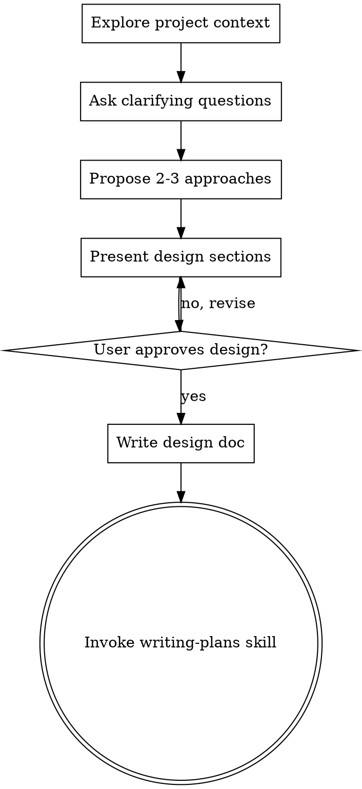

# Brainstorming Ideas Into Designs

## Overview

Help turn ideas into fully formed designs and specs through natural collaborative dialogue.

Start by understanding the current project context, then ask questions one at a time to refine the idea. Once you understand what you're building, present the design and get user approval.

<HARD-GATE>
Do NOT invoke any implementation skill, write any code, scaffold any project, or take any implementation action until you have presented a design and the user has approved it. This applies to EVERY project regardless of perceived simplicity.
</HARD-GATE>

## Anti-Pattern: "This Is Too Simple To Need A Design"

Every project goes through this process. A todo list, a single-function utility, a config change — all of them. "Simple" projects are where unexamined assumptions cause the most wasted work. The design can be short (a few sentences for truly simple projects), but you MUST present it and get approval.

## Checklist

You MUST create a task for each of these items and complete them in order:

1. **Explore project context** — check files, docs, recent commits
2. **Ask clarifying questions** — classify user intent, one question at a time, understand the required items to be explored specific to user intent
3. **Propose 2-3 approaches** — with trade-offs and your recommendation
4. **Present design** — in sections scaled to their complexity, get user approval after each section
5. **Write design doc** — save to `docs/plans/YYYY-MM-DD-<topic>-design.md` and commit
6. **Transition to implementation** — invoke writing-plans skill to create implementation plan

> **For Gemini CLI:** REQUIRED SUB-SKILL: Use writing-todos-gemini to create tasks.

## Process Flow

**The terminal state is invoking writing-plans.** Do NOT invoke frontend-design, mcp-builder, or any other implementation skill. The ONLY skill you invoke after brainstorming is writing-plans.

## Required items to be explored

You MUST explore and understand these items before writing design doc. You MUST include these items as a minimum in the design doc.

### User Intent

To scope requirements and design, classify user intent into one of the following categories:
| user intent category | use when |
|---|---|
| `behavioral-change:new-feature` | User wants a new externally observable capability |
| `behavioral-change:modify-feature` | User wants to change behavior of an existing capability |
| `behavioral-change:bugfix` | User wants to fix unintended behavior |
| `behavioral-change:enhance-quality-attribute` | User wants behavioral changes for performance, security, reliability, or availability |
| `structural-change` | User wants structural changes without external behavior changes |
| `documentation` | User wants documentation-focused outputs |
| `general` | Else case when none of the categories above fit clearly |

### Requirements

**behavioral-change:new-feature:**
- **Goal**:
  - **User story**: What the user wants to achieve and why, in "As a [role], I want [capability] so that [benefit]" format.
  - **Critical user journey**: Step-by-step user flow from trigger to outcome.
- **Non-Goal**: Capabilities or behaviors that might be reasonably expected but are intentionally excluded from this scope.
- **Acceptance Criteria (AC)**: Verifiable conditions that confirm the feature works as intended, written in Gherkin syntax (Feature/Scenario/Given/When/Then). Cover happy path, edge cases, and error cases.

[TBD: rest of user intent category]

### Design

[TBD: architecture, components, data flow, error handling, testing]

## The Process

**Understanding the idea:**
- Check out the current project state first (files, docs, recent commits)
- Classify user intent to define the required items to be explored specific to user intent
- Ask questions one at a time to refine the idea
- Prefer multiple choice questions when possible, but open-ended is fine too
- Only one question per message - if a topic needs more exploration, break it into multiple questions
- Focus on understanding ALL required items to be explored

**Exploring approaches:**
- Propose 2-3 different approaches with trade-offs
- Present options conversationally with your recommendation and reasoning
- Lead with your recommended option and explain why

**Presenting the design:**
- Once you believe you understand what you're building, present the design
- Scale each section to its complexity: a few sentences if straightforward, up to 200-300 words if nuanced
- Ask after each section whether it looks right so far
- Cover: architecture, components, data flow, error handling, testing
- Be ready to go back and clarify if something doesn't make sense

## After the Design

**Documentation:**
- Write the validated design to `docs/plans/YYYY-MM-DD-<topic>-design.md`
- Use writing-clearly-and-concisely skill if available
- Commit the design document to git

**Implementation:**
- Invoke the writing-plans skill to create a detailed implementation plan
- Do NOT invoke any other skill. writing-plans is the next step.

## Key Principles

- **One question at a time** - Don't overwhelm with multiple questions
- **Multiple choice preferred** - Easier to answer than open-ended when possible
- **YAGNI ruthlessly** - Remove unnecessary features from all designs
- **Explore alternatives** - Always propose 2-3 approaches before settling
- **Incremental validation** - Present design, get approval before moving on
- **Be flexible** - Go back and clarify when something doesn't make sense
