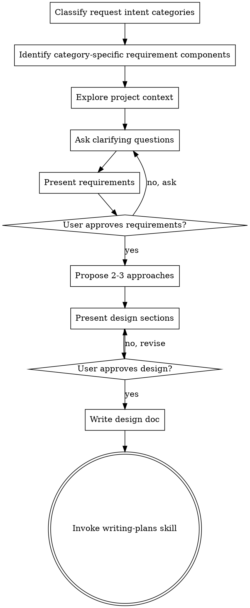

# Brainstorming Ideas Into Designs

## Overview

Help turn ideas into fully formed designs and specs through natural collaborative dialogue.

Start by understanding the current project context, then ask questions one at a time to refine the idea. Once you understand what you're building, present the design and get user approval.

<HARD-GATE>
Do NOT invoke any implementation skill, write any code, scaffold any project, or take any implementation action until you have presented a design and the user has approved it. This applies to EVERY project regardless of perceived simplicity.
</HARD-GATE>

## Anti-Pattern: "This Is Too Simple To Need A Design"

Every project goes through this process. A todo list, a single-function utility, a config change — all of them. "Simple" projects are where unexamined assumptions cause the most wasted work. The design can be short (a few sentences for truly simple projects), but you MUST present it and get approval.

## Checklist

You MUST create a task for each of these items and complete them in order:

1. **Classify request intent categories** — identify one or more applicable categories from `Request Intent Categories` list
2. **Identify category-specific requirement components** - define the scope of focus for subsequent understanding and exploration
3. **Explore project context** — check files, docs, recent commits
4. **Ask clarifying questions** — one at a time, understand requirements. get user approval once requirements are fully understood
5. **Present requirements** — get user approval for requirements
6. **Propose 2-3 approaches** — with trade-offs and your recommendation
7. **Present design** — in sections scaled to their complexity, get user approval after each section
8. **Write design doc** — save to `docs/plans/YYYY-MM-DD-<topic>-design.md` and commit
9. **Transition to implementation** — invoke writing-plans skill to create implementation plan

## Process Flow

**The terminal state is invoking writing-plans.** Do NOT invoke frontend-design, mcp-builder, or any other implementation skill. The ONLY skill you invoke after brainstorming is writing-plans.

## The Process

**Identifying the requirement components to define the exploration scope:**
- Classify request intent categories to scope requirements exploration:
    | intent category | use when |
    |---|---|
    | `behavioral-change:new-feature` | User wants a new externally observable capability |
    | `behavioral-change:modify-feature` | User wants to change behavior of an existing capability |
    | `behavioral-change:bugfix` | User wants to fix unintended behavior |
    | `behavioral-change:enhance-quality-attribute` | User wants behavioral changes for performance, security, reliability, or availability |
    | `structural-change` | User wants structural changes without external behavior changes |
    | `documentation` | User wants documentation-focused outputs |
    | `general` | Else case when none of the categories above fit clearly |
- Identify category-specific requirement components:
    - **behavioral-change:new-feature:**
        - Critical User Journey: identify it if clear; skip if ambiguous
        - Goal: define a User Story (`As a ... I want ... so that ...`)
        - Non-Goal: define explicit out-of-scope boundaries
        - Acceptance Criteria (AC): use Gherkin syntax for design/plan traceability
    - **general:**
        - purpose
        - constraints
        - success criteria

**Understanding the idea:**
- Check out the current project state first (files, docs, recent commits)
- Ask questions one at a time to refine the idea
- Prefer multiple choice questions when possible, but open-ended is fine too
- Only one question per message - if a topic needs more exploration, break it into multiple questions
- Focus on understanding requirements (Category-specific Requirements to Understand)
- Ask once requirements are fully understood whether it looks right so far

**Exploring approaches:**
- Propose 2-3 different approaches with trade-offs
- Present options conversationally with your recommendation and reasoning
- Lead with your recommended option and explain why

**Presenting the design:**
- Once you believe you understand what you're building, present the design
- Scale each section to its complexity: a few sentences if straightforward, up to 200-300 words if nuanced
- Ask after each section whether it looks right so far
- Cover: architecture, components, data flow, error handling, testing
- Be ready to go back and clarify if something doesn't make sense

## After the Design

**Documentation:**
- Write the validated design to `docs/plans/YYYY-MM-DD-<topic>-design.md`
- Use writing-clearly-and-concisely skill if available
- Commit the design document to git

**Implementation:**
- Invoke the writing-plans skill to create a detailed implementation plan
- Do NOT invoke any other skill. writing-plans is the next step.

## Key Principles

- **One question at a time** - Don't overwhelm with multiple questions
- **Multiple choice preferred** - Easier to answer than open-ended when possible
- **YAGNI ruthlessly** - Remove unnecessary features from all designs
- **Explore alternatives** - Always propose 2-3 approaches before settling
- **Incremental validation** - Present design, get approval before moving on
- **Be flexible** - Go back and clarify when something doesn't make sense
