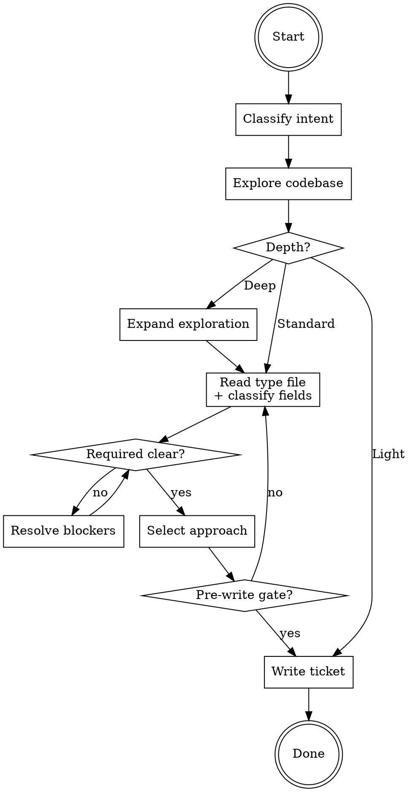

# Research

Research topic: **the user's research topic, provided as the skill argument**

If no topic was provided, ask the user what to research.

## Hard Gate

No planning, implementation, or production code changes. Only output: the research ticket. If the user rejects the process, explain the research ticket is the deliverable, ask which steps to abbreviate, and record skipped areas as gaps.

## Process

## Classify Intent

Infer **What**, **Why**, and **Type**:

| If... | Type |
|-------|------|
| Broken behavior deviating from expected | Bug |
| New capability or modifying existing behavior | Feature |
| Non-functional quality or structural refactoring | Improvement |
| Vulnerability, hardening, or compliance | Security |
| Bounded operation (migration, docs, testing, setup) | Task |
| Visual design, UX flow, or UI component work | Design-UI |

Tie-breaker: prefer the type whose Required fields best match the user's stated intent. Clear = all three have one reasonable interpretation. Ambiguous = ask one question.

Present classification and proceed. If the user objects, correct and continue.

**Exit:** Type established.

## Explore Codebase

Starting from the topic, search for relevant files, callers, and imports. Research external libs/APIs in parallel (use concurrent tool calls) if relevant. Present brief summary so user can redirect.

Thin results (< 2 relevant files or the topic's central question unanswered): retry once broader. Still thin — document gap, proceed.

**Exit:** Results obtained or gaps documented.

## Choose Depth

| Depth | Select when |
|-------|------------|
| **Light** | Fix obvious, 1-2 files, no ambiguity |
| **Standard** | Multiple files, some unknowns, bounded |
| **Deep** | Architectural, greenfield, cross-cutting, security |

Present chosen depth with reasoning. User may override.

After depth is confirmed, read `references/types/{type}.md`.

Deep only: expand exploration (2-3 concerns in parallel using concurrent tool calls, cap 3 rounds) before classifying fields.

**Exit:** Depth confirmed.

## Classify Fields

Classify each field from the type file. Start every field at `missing`; promote only with evidence.

### Status Table

| Status | Meaning | Action |
|--------|---------|--------|
| `clear` | Specific, actionable — one interpretation | Ready |
| `unclear` | Ambiguous or contradictory | R: blocks. O: gap + risk |
| `missing` | No information found | R: blocks. O: gap + risk |

All types share one common Optional field: **Non-goals** (scope boundaries preventing over-exploration).

### Resolve Required Blockers

Ask Required `unclear`/`missing` fields first. Batch related questions. After 2 attempts on the same blocker, ask for risk override. For unresolved fields record: why needed, risk if missing, user-approved risk.

### Resolve Optional Gaps

Document gap + risk for Optional `unclear`/`missing` fields. Do not block on Optional fields.

### Deep: Verify Evidence

For Deep depth only: confirm `clear` evidence is specific enough for the chosen depth.

**Exit:** All fields `clear` or gaps user-approved.

## Select Approach

Present 2-3 approaches with trade-offs and file:line refs. Include:

- Relevant external research with source URLs (feeds External Research)
- Why other approaches were considered but not recommended (feeds Rejected Approaches)

After selection, build DoD from type template + ticket-specific criteria; present for approval.

**Exit:** Approach selected, DoD approved.

## Write Ticket

Output using `references/research-ticket-template.md`. Must start with `# Research Ticket`. Light: omit N/A sections.

**Pre-write gate — ALL true:**
1. DoR passes (Required `clear`, Optional `clear` or gap-approved)
2. DoD approved (Standard/Deep) or stated inline (Light)
3. Approach confirmed
4. Scope boundaries explicit

Gate fails — return to the step indicated by the flowchart.

**Producing each section:**

- **Context** — from Classify Intent (type) and Choose Depth (depth, objective)
- **Problem Statement** — from Classify Intent (what/why)
- **Definition of Ready** — from Classify Fields (field statuses and evidence)
- **Definition of Done** — from Select Approach (type template + ticket-specific criteria)
- **Codebase Findings** — from Explore Codebase (files, patterns, dependencies)
- **External Research** — from Explore Codebase and Select Approach (web findings with source URLs)
- **Chosen Approach** — from Select Approach (what, why, file:line refs)
- **Rejected Approaches** — from Select Approach (what, why considered, why rejected, revisit-if)
- **Anti-Patterns** — from Explore Codebase (do-not / reasoning pairs discovered during exploration)
- **Scope Boundaries** — from Classify Fields Non-goals field (in scope / out of scope)
- **Open Questions** — from Classify Fields (unresolved questions, suggested defaults)
- **Handoff Notes** — synthesized from all findings (starting point, patterns, risks, complexity)

**Self-check:** verify the ticket contains: problem statement, testable requirements, file:line evidence, rationale.

Save to: `docs/research/YYYY-MM-DD-<topic>.md`. End skill after writing.
