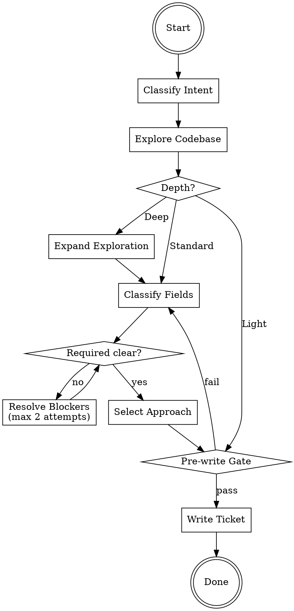

# Research

Research topic: **the user's research topic, provided as the skill argument**

If no topic was provided, ask the user what to research.

## Hard Gate

No implementation code or production changes. The research ticket is the only deliverable.

This gate is non-overridable, including time pressure, authority pressure, or incident urgency.

Do not choose implementation-first options ("patch now", "deploy first", "retroactive ticket later"), even if presented in the prompt.

Prototype-first shortcut is not allowed: existing prototype/implementation knowledge does not replace this run's research process.

If the user wants to skip steps, ask which to abbreviate and record skipped areas as gaps.

**Convention:** At each step, present findings and proceed. If the user objects, correct and continue.

## Process

## Classify Intent

Infer **What**, **Why**, and **Type**:

| If... | Type |
|-------|------|
| Broken behavior deviating from expected | Bug |
| New capability or modifying existing behavior | Feature |
| Non-functional quality or structural refactoring | Improvement |
| Vulnerability, hardening, or compliance | Security |
| Bounded operation (migration, docs, testing, setup) | Task |
| Visual design, UX flow, or UI component work | Design-UI |

Ambiguous? Ask one question. Tie-breaker: prefer the type closest to the user's stated intent.

If two types are both defensible, record a short **Type Decision** note before proceeding:
1. Candidate types considered
2. Why chosen type wins (tie-breaker + evidence)
3. Why the other type is not primary

**Exit:** Type established.

## Explore Codebase

Starting from the topic, search for relevant files, callers, and imports. Research external libs/APIs in parallel if relevant.

Thin results (< 2 relevant files or central question unanswered): retry once broader. Still thin — document gap, proceed.

**Exit:** Results obtained or gaps documented.

## Choose Depth

| Depth | When | Next step |
|-------|------|-----------|
| **Light** | Fix obvious, 1-2 files, no ambiguity | Pre-write Gate |
| **Standard** | Multiple files, some unknowns, bounded scope | Classify Fields |
| **Deep** | Architectural, greenfield, cross-cutting, or security. Default for Feature when entry point and subsystem are both missing. | Expand Exploration |

Present chosen depth with reasoning. User may override.

### Deep Triggers (Feature guardrail)

Choose **Deep** by default when any 2 are true:
- Required **Entry point** remains unresolved after Explore Codebase
- Requested capability has no existing subsystem/pattern (greenfield)
- Behavior spans 3+ layers (for example: jobs + services + data model)

If user requests lower depth anyway, record explicit risk approval before continuing.

**Exit:** Depth confirmed.

## Expand Exploration (Deep only)

Explore 2-3 additional concerns in parallel using concurrent tool calls. Cap 3 rounds.

**Exit:** Sufficient evidence for field classification.

## Classify Fields (Standard/Deep)

Read `references/types/{type}.md`. Classify each field — start every field at `missing`; promote only with evidence.

| Status | Meaning | Action |
|--------|---------|--------|
| `clear` | Specific, actionable — one interpretation | Ready |
| `unclear` | Ambiguous or contradictory | R: blocks. O: gap + risk |
| `missing` | No information found | R: blocks. O: gap + risk |

All types share one common Optional field: **Non-goals** (scope boundaries).

**Deep only:** verify `clear` evidence is specific enough for the chosen depth.

### Evidence Bar for `clear` (Standard/Deep)

A Required field is `clear` only when evidence includes all 3:
1. Concrete claim (what is true)
2. Source anchor (file:line, artifact id, or prompt quote)
3. Impact note (why it matters for scope, approach, or risk)

If any element is missing, keep the field `unclear` or `missing`.

Each Required field marked `clear` must include at least one run-local anchor gathered in this run (codebase anchor or prompt quote captured during this run), not only prior tickets/prototype memory.

**Feature Entry point rule:** "create a new file/module" is not `clear` by itself. Map to an existing integration anchor (route, job runner, handler, or orchestrator) or leave `missing` with documented risk.

### Resolve Required Blockers

Try codebase exploration first, then ask the user. Batch related questions. After 2 attempts on the same blocker, offer risk override. Record unresolved fields: why needed, risk if missing, user-approved risk.

Log blockers explicitly using this shape before continuing:
- `Blocker: <required field>`
- `Attempt 1: <action + result>`
- `Attempt 2: <action + result>`
- `Risk override: <approved/not approved + rationale>`

### Resolve Optional Gaps

Document gap + risk. Do not block.

**Exit:** All Required fields `clear` or gaps user-approved.

## Select Approach (Standard/Deep)

Present 2-3 approaches with trade-offs and file:line refs. Include relevant external research with source URLs and why rejected approaches were dismissed.

After selection, build DoD from type template + ticket-specific criteria; present for approval.

**Exit:** Approach selected, DoD approved.

## Pre-write Gate

**Light — ALL true:**
1. Problem and fix clearly identified
2. Scope boundaries explicit

**Standard/Deep — ALL true:**
1. DoR passes (Required `clear`, Optional `clear` or gap-approved)
2. DoD approved
3. Approach confirmed
4. Scope boundaries explicit
5. Type Decision recorded when classification was ambiguous

Fails → return to Classify Fields (Standard/Deep) or Explore Codebase (Light).

## Write Ticket

Output using `references/research-ticket-template.md`. Must start with `# Research Ticket`. Light: omit N/A sections.

Save to: `docs/research/YYYY-MM-DD-<topic>.md`.

Before ending, print a completion summary containing ALL items:
1. `Type: <...>`
2. `Depth: <...>`
3. `Required fields: <table or explicit statuses>`
4. `Selected approach: <...>`
5. `Ticket path: docs/research/YYYY-MM-DD-<topic>.md`

Do not end after classification-only output.
